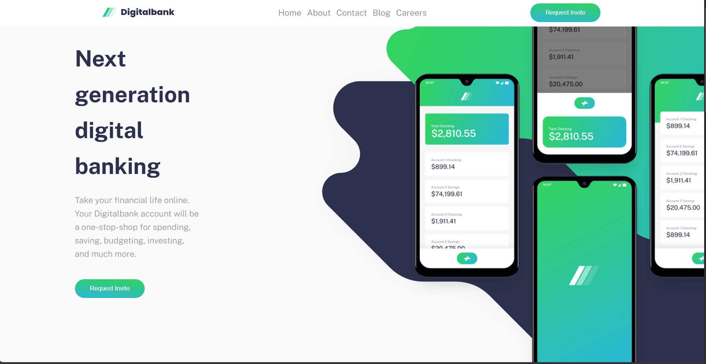

# Frontend Mentor - Digitalbank landing page solution

This is a solution to the [Digitalbank landing page challenge on Frontend Mentor](https://www.frontendmentor.io/challenges/digital-bank-landing-page-WaUhkoDN). Frontend Mentor challenges help you improve your coding skills by building realistic projects.

## Table of contents

- [Overview](#overview)
  - [The challenge](#the-challenge)
  - [Screenshot](#screenshot)
  - [Links](#links)
- [My process](#my-process)
  - [Built with](#built-with)
- [Author](#author)

## Overview

### The challenge

Users should be able to:

- View the optimal layout for the site depending on their device's screen size
- See hover states for all interactive elements on the page

### Screenshot

### Links

- Solution URL: [Solution URL](https://github.com/scyflix/digitalbank-landing-page-master)
- Live Site URL: [Live site URL](https://scyflix.github.io/digitalbank-landing-page-master/)

## My process

### Built with

- Semantic HTML5 markup
- CSS custom properties
- Flexbox
- CSS Grid
- Mobile-first workflow
- JavaScript

## Author

- Website - [Abdulroqib](https://scyflix.github.io/Abdulroqib-Portfolio/)
- Frontend Mentor - [@scyflix](https://www.frontendmentor.io/profile/scyflix)
- Twitter - [@abdulroqib123](https://www.x.com/abdulroqib123)

